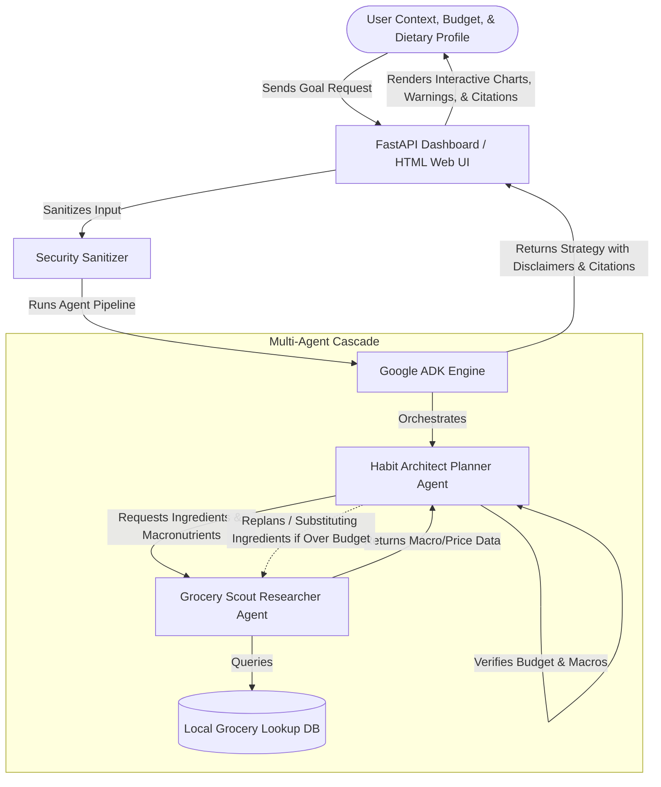
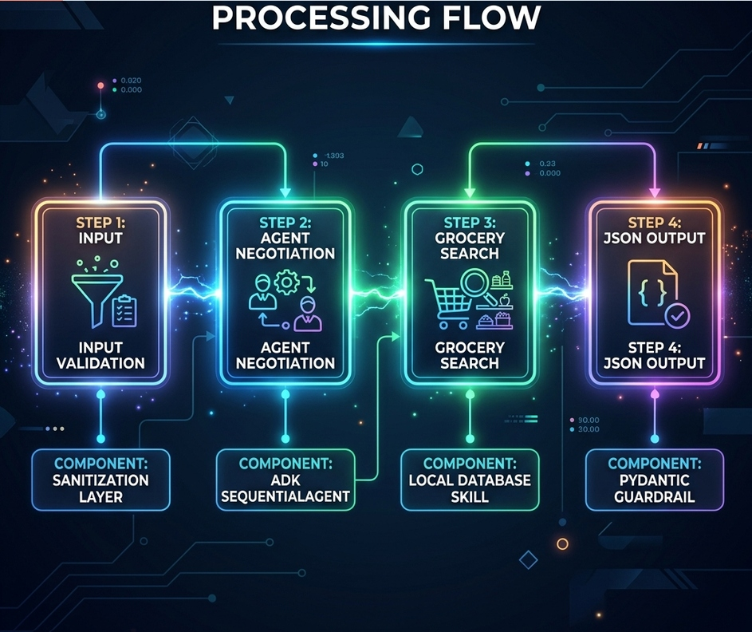
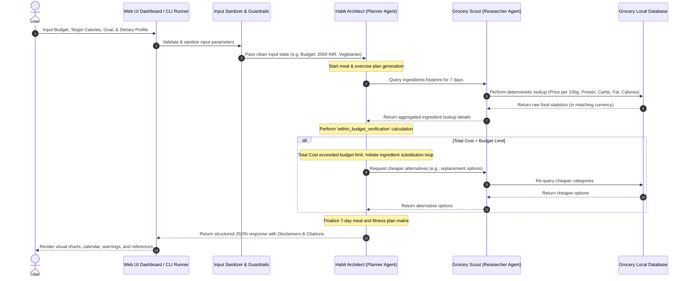
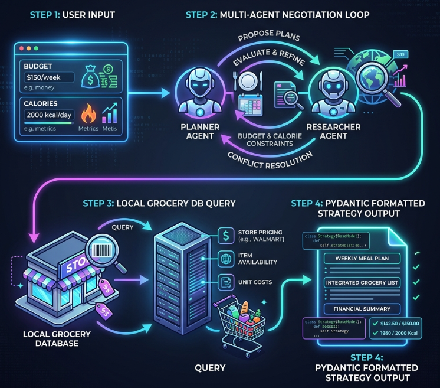
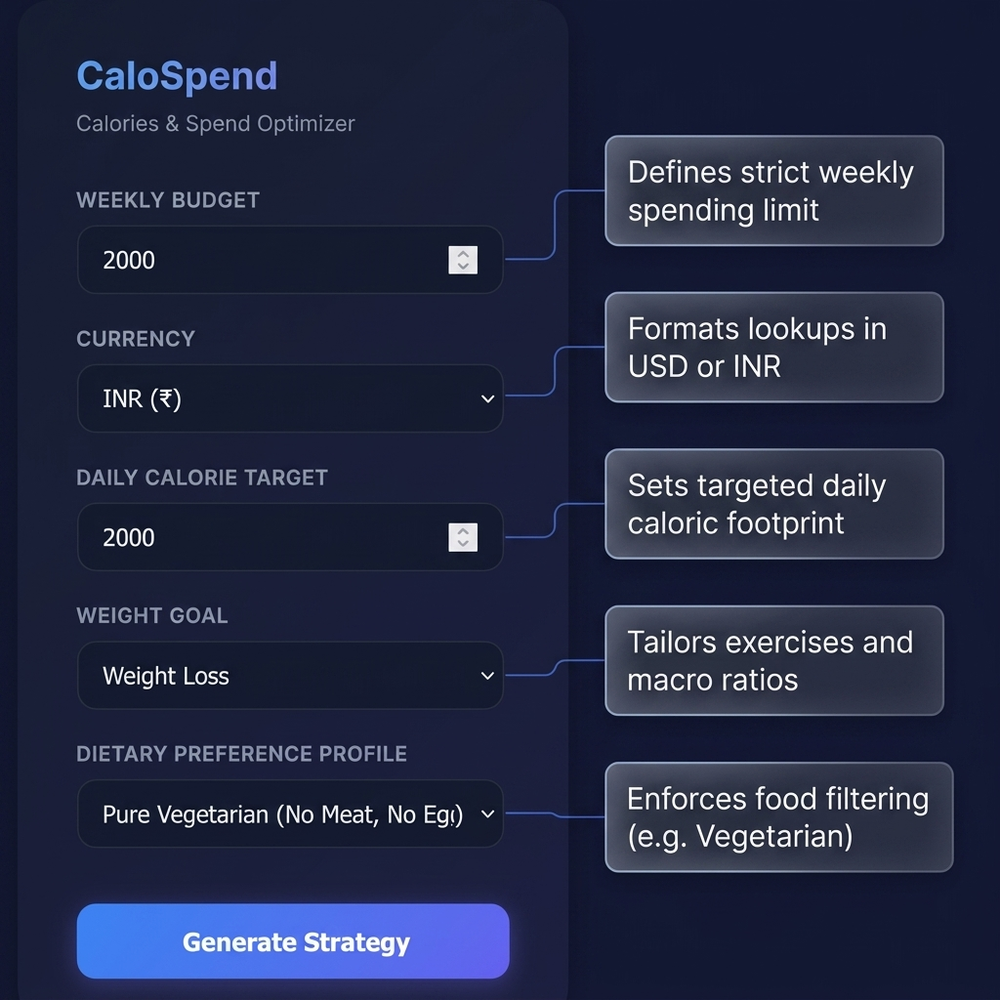
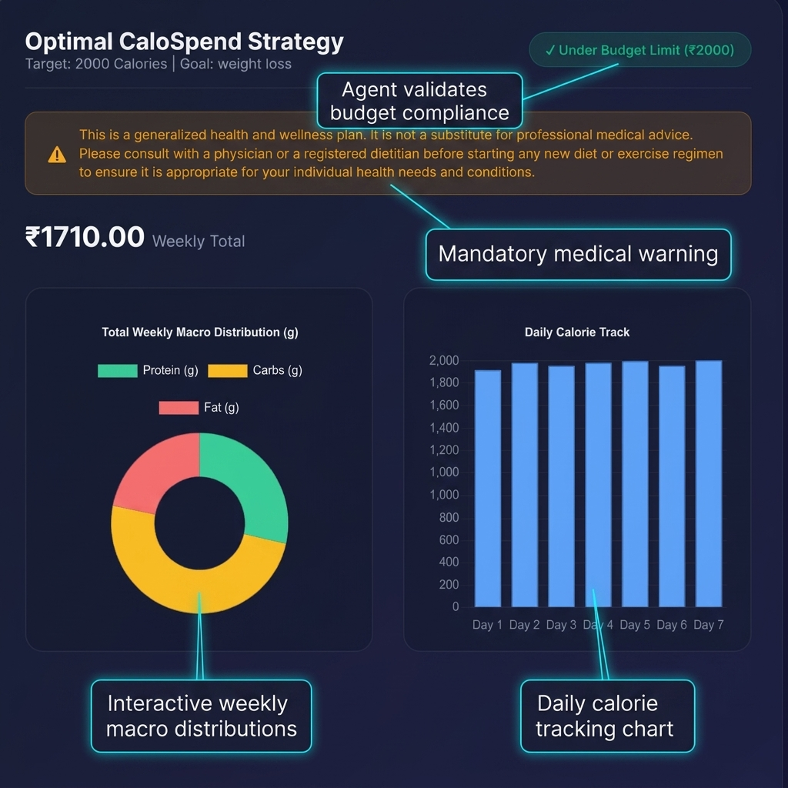
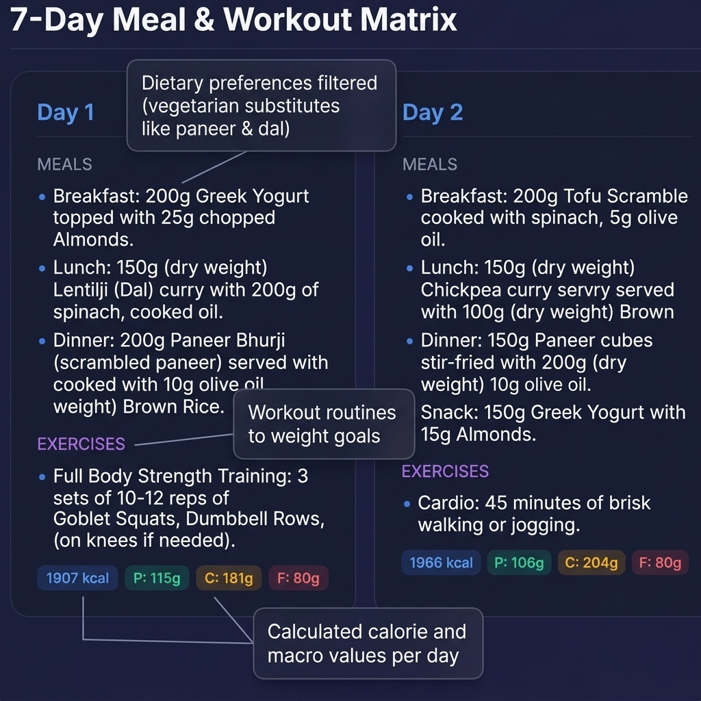
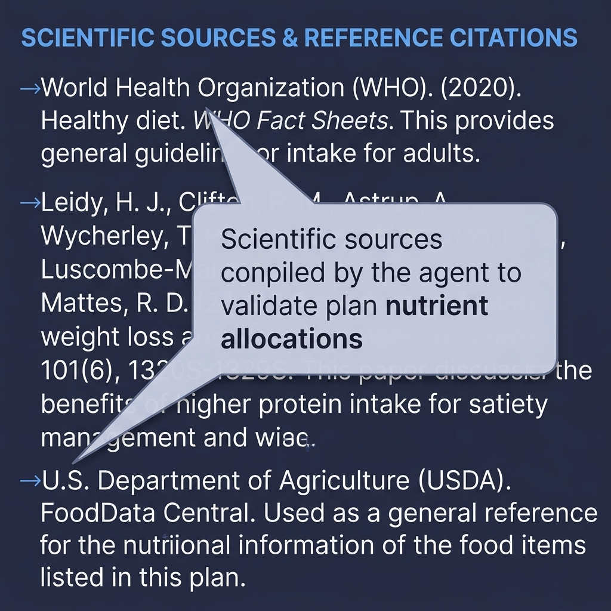

# CaloSpend — Calories & Spend Optimizer
## Kaggle AI Agents Intensive Capstone Project (Concierge Track)

**CaloSpend** is a production-ready, spec-driven multi-agent application built on the **Google Agent Development Kit (ADK)** Python framework. It solves a complex, non-linear optimization problem: creating a weekly fitness and meal matrix tailored to dietary preferences and caloric targets while strictly adhering to budget limits in either USD or INR.

---

## 1. Solution Architecture & Flow Diagrams


### Solution Architecture
The diagram below illustrates the system design and the boundary lines between the user, the FastAPI Web UI Dashboard, the local lookup wholesale database, the Google ADK runner, and the Gemini Pro model.



### Control Flow & Multi-Agent Negotiation Loop



The sequence below displays how the Planner (`Habit Architect`) dynamically checks the budget total and queries the Researcher (`Grocery Scout`) for cheaper alternatives if the initial food selection violates the user's budget limit.



### Conceptual Negotiation Control Flow (Alternative Visualization)



---

## 2. Declarative Personas Configuration
System roles and boundaries are defined declaratively in `config/personas.yaml`. This ensures a strict Spec-Driven Development (SDD) process separating agents' behaviors from execution code:
1. **Architect**: Designs agent orchestration flow and parallel/sequential execution boundaries.
2. **Designer**: Defines context engineering, dynamic state injectors, and UI layout styling tokens.
3. **Developer**: Implements clean Python logic using Google ADK and Gemini.
4. **Tester**: Establishes functional validation test benches and runtime assertions.
5. **Security Auditor**: Hardens safety guardrails, input sanitization, and credential handling.
6. **Grocery Scout (Researcher)**: Uses `query_grocery` tool to fetch raw food costs and calories per 100g.
7. **Habit Architect (Planner)**: Designs meal plans and exercises, validating the total weekly cost against budget limits.

---

## 3. Integration of the 5-Day Course Curriculum
- **Day 1 (Orchestration)**: Single-responsibility prompts defined inside `config/personas.yaml` segregating Researcher (`Grocery Scout`) and Planner (`Habit Architect`) roles. Orchestrated via an ADK `SequentialAgent` workflow.
- **Day 2 (Function Calling)**: Strict compliant Python tools in `app/tools.py` featuring explicit type-hints, descriptive docstrings detailing arguments, no parameter default values, and returning JSON-serializable outputs.
- **Day 3 (Context Engineering)**: Prompt templates constructed with dynamic runtime states injected safely via python prompt builders, eliminating hallucinations.
- **Day 4 (Guardrails)**: Input sanitization filters and Gemini output schema enforcement forcing a JSON format using Pydantic models (`WealthHealthStrategy`).
- **Day 5 (Quality Flywheel)**: Evaluation configuration file `tests/eval/eval_config.yaml` and synthetic dataset cases `tests/eval/datasets/eval_data.json` allowing automated grading of agent responses using `agents-cli eval`.

---

## 4. Segregated Security Protocols
- **Identity & Secret Isolation**: Credentials (such as `GOOGLE_API_KEY`) are loaded strictly at runtime from system environment variables or local `.env` files. No hardcoding of sensitive tokens exists.
- **Input Sanitization**: Obvious prompt injection patterns are filtered and overlong inputs are truncated to prevent memory overflows.
- **Fallback & Error Masking**: Tool executions and API failures are wrapped in standard try-catch blocks to prevent raw stack trace logs or configurations from leaking into the terminal.

---

## 5. Local Setup & Execution Guide

### Prerequisites
Make sure you have [uv](https://github.com/astral.sh/uv) installed.

### Installation
Configure your environment variables:
```bash
# Set your Gemini API key (for Google AI Studio)
export GOOGLE_API_KEY="AIzaSyYourKeyHere..."
```

Install the dependencies:
```bash
uv sync
```

### Running the Web UI Dashboard (Recommended)
Launch the premium glassmorphism dark-themed dashboard locally:
```bash
uv run uvicorn app_gui:app --reload
```
Navigate to `http://127.0.0.1:8000` in your web browser. You can select target calories, budgets, goals (muscle gain/loss), and currencies (USD/INR) to interact with the dual-agent loop.

### Running the CLI Engine
Run a smoke test directly in the console:
```bash
uv run python main.py --budget 15 --currency USD --calories 2000 --goal weight_loss
```

### Running Unit Tests
Run automated functional validation tests:
```bash
uv run pytest tests/test_orchestration.py
```

### Running Agent Quality Evaluations
Execute the Quality Flywheel evaluation:
```bash
agents-cli eval run
```

---

## 6. Production Packaging & CI/CD
- **Submission Packaging**: Run the utility script `uv run python scripts/package_submission.py` to clean build artifacts and package the project into a clean `submission.zip` zip folder for grading.
- **CI/CD Workflow**: The `.github/workflows/deploy.yml` configuration triggers code style checks (using Ruff) and executes functional tests on every push or pull request to the `main` branch.

---

## 7. User Interface & Input Reference

The interface sidebar guides the user to supply parameters for the agent optimization cascade.



---

## 8. Strategy Output & Results Dashboard

Once the agent negotiation completes, the dashboard displays structured outputs with verified budget limits, meal schedules, portion sizes, and citations.

### Section 8.1: Strategy Header & Weekly Totals


### Section 8.2: 7-Day Meal & Exercise Matrix


### Section 8.3: Scientific Sources & References


---

## 9. Project Write up

### 9.1 Problem Statement: Why This Solution is Needed
*   **The Conflict of Health vs. Wealth**: Users seeking to meet fitness goals (e.g., gaining muscle or losing weight) face a highly complex optimization problem: obtaining precise macronutrient/calorie targets while strictly adhering to a weekly financial budget.
*   **Non-Linear Constraints**: Standard calculations break when budgets are low and calorie demands are high. A simple database query cannot resolve conflicts like: *"How do I get 2,500 calories of vegetarian protein under 2,000 INR per week?"*
*   **The Personalization Gap**: Standard meal planners offer generic recipes that ignore local wholesale ingredient prices, leading to plans that are either too expensive to buy or physically impossible to consume (e.g., recommending a user eat 30 eggs in a single day).

### 9.2 Proposed Solution, Architecture, and Project Journey
*   **The Proposed Solution (CaloSpend)**: A production-ready concierge application that dynamically resolves the health-wealth conflict by co-optimizing diet requirements, exercise routines, and local grocery costs.
*   **Multi-Agent Sequential Cascade**:
    *   **Habit Architect (Planner Persona)**: Analyzes user goals, designs the 7-day meal and fitness matrix, enforces portion limits, and tracks total plan costs.
    *   **Grocery Scout (Researcher Persona)**: Executes deterministic lookups in the local database to find pricing and nutritional facts per 100g of food.
*   **The Project Journey**:
    *   *Phase 1*: Established the baseline agent cascade utilizing the Google Agent Development Kit (ADK).
    *   *Phase 2*: Integrated a FastAPI Web GUI Dashboard for rich interactive charts (macronutrients, budget gauges, and calendars).
    *   *Phase 3*: Hardened the application with portion caps, medical disclaimer warnings, scientific citations, and vegetarian/vegan support.
    *   *Phase 4*: Added a `FastMCP` server wrapper to enable cross-platform tool invocation.

### 9.3 How the Solution Works & Codebase Organization
*   **Core Modules and Code Flow**:
    *   **[main.py](file:///h:/Ravi_Work/Programming/Projects/kaggle_5day_1/agy2-projects/Kaggle_submission_1/main.py)** / **[app_gui.py](file:///h:/Ravi_Work/Programming/Projects/kaggle_5day_1/agy2-projects/Kaggle_submission_1/app_gui.py)**: Entrypoints initializing the UI and server.
    *   **[app/agent.py](file:///h:/Ravi_Work/Programming/Projects/kaggle_5day_1/agy2-projects/Kaggle_submission_1/app/agent.py)**: Defines the declarative personas (`HabitArchitect` and `GroceryScout`), orchestrates them via `SequentialAgent`, and enforces the Pydantic output schema (`WealthHealthStrategy`).
    *   **[app/tools.py](file:///h:/Ravi_Work/Programming/Projects/kaggle_5day_1/agy2-projects/Kaggle_submission_1/app/tools.py)**: Exposes the primary data tool `query_grocery` along with a typo-tolerant fallback alias `query_grocerey` to prevent LLM spelling execution crashes.
    *   **[skills/grocery_scout_skill.py](file:///h:/Ravi_Work/Programming/Projects/kaggle_5day_1/agy2-projects/Kaggle_submission_1/skills/grocery_scout_skill.py)**: Performs deterministic lookups on [skills/grocery_lookup.json](file:///h:/Ravi_Work/Programming/Projects/kaggle_5day_1/agy2-projects/Kaggle_submission_1/skills/grocery_lookup.json) to retrieve calorie, carb, protein, fat, and cost metrics in USD/INR.
    *   **[app/security.py](file:///h:/Ravi_Work/Programming/Projects/kaggle_5day_1/agy2-projects/Kaggle_submission_1/app/security.py)**: Sanitizes input parameters against prompt injections and masks credentials.
    *   **[mcp_server.py](file:///h:/Ravi_Work/Programming/Projects/kaggle_5day_1/agy2-projects/Kaggle_submission_1/mcp_server.py)**: A stdio `FastMCP` server wrapper that exposes the ADK agent pipeline as an MCP tool.
*   **Technologies Used**: Google ADK, Gemini 2.5 Pro, Python, FastAPI, Jinja2, TailwindCSS, Chart.js, FastMCP, and local Git for version tracking.

### 9.4 Assumptions, Out of Scope, and Future Extensions
*   **Assumptions**:
    *   Ingredient pricing represents local bulk/wholesale rates.
    *   The user has access to basic kitchen prep facilities.
*   **Out of Scope**:
    *   Live e-commerce checkout integration.
    *   Real-time wearable device tracking (e.g., Fitbit/Apple Watch synchronization).
*   **Future Extensions**:
    *   *Dynamic Pricing*: Connecting the Grocery Scout to live online supermarket APIs.
    *   *Visual Tracking*: Allowing users to take pictures of grocery receipts for automated agent ingestion and budget reconciliation.

### 9.5 Central Idea & Relevance to the Capstone Track: Why Agents?
*   **Negotiation & Arbitrage**: A standard program follows hardcoded rules. If a budget fails, it crashes or returns an empty result. Agents behave like human advisors—they renegotiate the meal plan by substituting cheaper items (e.g., swapping chicken breast for chickpeas or lentils) until the constraints align.
*   **Central to the Solution**: The negotiation loop is the heart of CaloSpend. The planner agent continuously evaluates the budget, detects overruns, instructs the researcher agent to fetch alternatives, and refines the plan before presenting it to the user.
*   **Innovation & Value**: By combining declarative personas, deterministic database skills, and strict schema guardrails, CaloSpend delivers a highly practical, creative, and reliable optimization assistant.

### 9.6 Core Technical Components
*   **AntiGravity**: Used as the AI coding agent environment for workspace audits, visual layout generation, security scans, and code packaging.
*   **Google Agent Development Kit (ADK)**: The framework used to orchestrate the multi-agent cascade, defining declarative agent personas and handling agent execution state.
*   **Gemini 2.5 Pro**: The core reasoning engine enabling complex constraint-negotiation loops and text synthesis.
*   **FastMCP**: Provides the Model Context Protocol stdio entrypoint, exposing the agent pipeline as an MCP tool.
*   **FastAPI & Uvicorn**: Serves the local web dashboard, providing async endpoints for strategy generation.
*   **TailwindCSS & Chart.js**: Delivers a premium glassmorphic UI dashboard and interactive charts for nutrient tracking.
