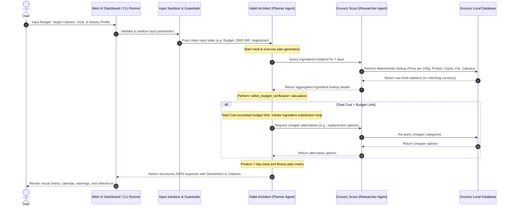

# The Wealth-Health Strategist (Wellness + Finance)
## Kaggle AI Agents Intensive Capstone Project (Concierge Track)

The **Wealth-Health Strategist** is a production-ready, spec-driven multi-agent application built on the **Google Agent Development Kit (ADK)** Python framework. It solves a complex, non-linear optimization problem: creating a weekly fitness and meal matrix tailored to dietary preferences and caloric targets while strictly adhering to budget limits in either USD or INR.

---

## 1. Solution Architecture & Flow Diagrams

### Solution Architecture
The diagram below illustrates the system design and the boundary lines between the user, the FastAPI Web UI Dashboard, the local lookup wholesale database, the Google ADK runner, and the Gemini Pro model.


### Control Flow & Multi-Agent Negotiation Loop
The sequence below displays how the Planner (`Habit Architect`) dynamically checks the budget total and queries the Researcher (`Grocery Scout`) for cheaper alternatives if the initial food selection violates the user's budget limit.



---

## 2. Declarative Personas Configuration
System roles and boundaries are defined declaratively in `config/personas.yaml`. This ensures a strict Spec-Driven Development (SDD) process separating agents' behaviors from execution code:
1. **Architect**: Designs agent orchestration flow and parallel/sequential execution boundaries.
2. **Designer**: Defines context engineering, dynamic state injectors, and UI layout styling tokens.
3. **Developer**: Implements clean Python logic using Google ADK and Gemini.
4. **Tester**: Establishes functional validation test benches and runtime assertions.
5. **Security Auditor**: Hardens safety guardrails, input sanitization, and credential handling.
6. **Grocery Scout (Researcher)**: Uses `query_grocery` tool to fetch raw food costs and calories per 100g.
7. **Habit Architect (Planner)**: Designs meal plans and exercises, validating the total weekly cost against budget limits.

---

## 3. Integration of the 5-Day Course Curriculum
- **Day 1 (Orchestration)**: Single-responsibility prompts defined inside `config/personas.yaml` segregating Researcher (`Grocery Scout`) and Planner (`Habit Architect`) roles. Orchestrated via an ADK `SequentialAgent` workflow.
- **Day 2 (Function Calling)**: Strict compliant Python tools in `app/tools.py` featuring explicit type-hints, descriptive docstrings detailing arguments, no parameter default values, and returning JSON-serializable outputs.
- **Day 3 (Context Engineering)**: Prompt templates constructed with dynamic runtime states injected safely via python prompt builders, eliminating hallucinations.
- **Day 4 (Guardrails)**: Input sanitization filters and Gemini output schema enforcement forcing a JSON format using Pydantic models (`WealthHealthStrategy`).
- **Day 5 (Quality Flywheel)**: Evaluation configuration file `tests/eval/eval_config.yaml` and synthetic dataset cases `tests/eval/datasets/eval_data.json` allowing automated grading of agent responses using `agents-cli eval`.

---

## 4. Segregated Security Protocols
- **Identity & Secret Isolation**: Credentials (such as `GOOGLE_API_KEY`) are loaded strictly at runtime from system environment variables or local `.env` files. No hardcoding of sensitive tokens exists.
- **Input Sanitization**: Obvious prompt injection patterns are filtered and overlong inputs are truncated to prevent memory overflows.
- **Fallback & Error Masking**: Tool executions and API failures are wrapped in standard try-catch blocks to prevent raw stack trace logs or configurations from leaking into the terminal.

---

## 5. Local Setup & Execution Guide

### Prerequisites
Make sure you have [uv](https://github.com/astral.sh/uv) installed.

### Installation
Configure your environment variables:
```bash
# Set your Gemini API key (for Google AI Studio)
export GOOGLE_API_KEY="AIzaSyYourKeyHere..."
```

Install the dependencies:
```bash
uv sync
```

### Running the Web UI Dashboard (Recommended)
Launch the premium glassmorphism dark-themed dashboard locally:
```bash
uv run uvicorn app_gui:app --reload
```
Navigate to `http://127.0.0.1:8000` in your web browser. You can select target calories, budgets, goals (muscle gain/loss), and currencies (USD/INR) to interact with the dual-agent loop.

### Running the CLI Engine
Run a smoke test directly in the console:
```bash
uv run python main.py --budget 15 --currency USD --calories 2000 --goal weight_loss
```

### Running Unit Tests
Run automated functional validation tests:
```bash
uv run pytest tests/test_orchestration.py
```

### Running Agent Quality Evaluations
Execute the Quality Flywheel evaluation:
```bash
agents-cli eval run
```

---

## 6. Production Packaging & CI/CD
- **Submission Packaging**: Run the utility script `uv run python scripts/package_submission.py` to clean build artifacts and package the project into a clean `submission.zip` zip folder for grading.
- **CI/CD Workflow**: The `.github/workflows/deploy.yml` configuration triggers code style checks (using Ruff) and executes functional tests on every push or pull request to the `main` branch.
